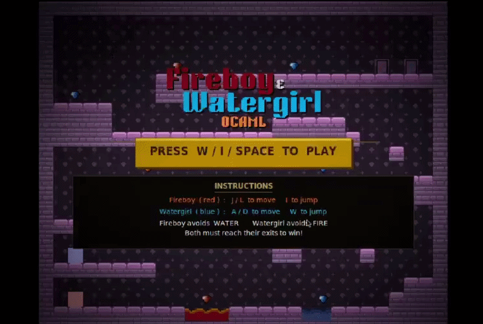

# Fireboy & Watergirl — OCaml Edition

[](https://github.com/bryanshao07/fireboy-and-watergirl-ocaml/actions/workflows/ci.yml)

A two-player co-op puzzle-platformer built from scratch in OCaml, rendering
through the X11 `Graphics` library. Two players each control one character —
Fireboy and Watergirl — and must cooperate to collect gems and reach their
matching exits, while avoiding element-specific hazards: Fireboy dies in water,
Watergirl dies in fire, and both die in acid.

> Originally built as a CS 3110 (Functional Programming) final project.
> [Demo video](https://www.youtube.com/watch?v=doHxtFW-JR0)



## Highlights

- **Custom physics engine** — fixed-timestep gravity, friction, and jumping
  with swept tile-collision resolution that snaps players to tile edges and
  zeroes velocity on impact (`lib/physics.ml`).
- **From-scratch rendering** — nearest-neighbor sprite scaling, horizontal
  sprite flipping, and per-pixel RGBA alpha-compositing for the vignette
  overlay, all built on the bare `Graphics` image API (`lib/sprite.ml`,
  `lib/render.ml`).
- **Native two-player input** — a small C stub over X11's `XQueryKeymap`
  enables true simultaneous key polling for both players, which OCaml's
  `Graphics` event model can't do on its own (`lib/x11_input.c`,
  `lib/input.ml`). Jumps are edge-triggered (fire on key-down, not while held).
- **Pure, tested core** — game state is modeled as an explicit
  `Playing | Resetting | Won` state machine updated by a pure `tick` function.
  65 OUnit2 tests give **100% line coverage** on all game logic — collision,
  win/loss detection, gem collection, and state transitions — measured with
  `bisect_ppx`, plus tests for the JSON level loader.
- **Data-driven levels** — levels are JSON files (`levels/*.json`) loaded at
  startup, authored with a standalone Python editor; see [Levels](#levels).

## Architecture

The code separates pure game logic from I/O (rendering and input), so the core
can be unit-tested without a display:

| Module        | Responsibility                                                   |
| ------------- | ---------------------------------------------------------------- |
| `level`       | Tile grid: parsing, bounds-checked queries, copying (pure)       |
| `level_loader`| Loads levels from JSON files into the tile grid (`yojson`)        |
| `player`      | Player state record and character types (pure)                   |
| `physics`     | Movement, gravity, and tile collision resolution (pure)          |
| `game`        | Top-level state machine and `tick` update loop (pure)            |
| `input`       | Keyboard sampling and edge-triggered "just pressed" detection    |
| `sprite`      | Image loading, scaling, flipping, and alpha-blending             |
| `render`      | All on-screen drawing: levels, players, HUD, intro/win screens   |
| `bin/main`    | The game loop wiring input → update → render together            |

Every module has an `.mli` interface documenting its public API.

## Levels

Levels are **data-driven**: each level is a JSON file in `levels/`, loaded at
startup by `level_loader` (which uses `yojson`) into the game's tile grid. The
game plays them in order — beat one to advance to the next — as listed in
`level_paths` in `bin/main.ml`.

### JSON format

```json
{
  "name": "Level 1",
  "width": 28,
  "height": 23,
  "legend": { "#": "wall", "F": "fire_pool", "1": "spawn_fire" },
  "grid": [ "############", "#1        F#" ]
}
```

`grid` is an array of `height` strings, each exactly `width` characters; every
character must appear as a single-character key in `legend`, mapped to one of
the tile names: `empty`, `wall`, `platform`, `fire_pool`, `water_pool`, `acid`,
`fire_door`, `water_door`, `gem_fire`, `gem_water`, `button`, `spawn_fire`,
`spawn_water`.

### Level editor (`tools/level_editor.py`)

A standalone Python tool (standard library only — no `pip install`) for
creating and editing levels. Two interactive modes plus headless helpers:

```
python3 tools/level_editor.py                  # tkinter GUI: click/drag to paint
python3 tools/level_editor.py --text           # terminal (curses) editor, no GUI
python3 tools/level_editor.py --show f.json    # print a level to stdout
python3 tools/level_editor.py --new W H f.json # write a blank level
```

The **GUI** offers a color-coded tile palette and click/drag painting
(right-click erases). The **`--text`** editor works in any terminal with no GUI
toolkit — use it if tkinter is unavailable (some Anaconda Tk builds abort on
recent macOS): arrow keys or `hjkl` to move, a tile key to paint, `space` to
repaint the current brush, `x` to erase, and vim-style `:w` / `:q` / `:name` /
`:new W H` commands.

## Controls

| Action  | Fireboy   | Watergirl |
| ------- | --------- | --------- |
| Move    | `J` / `L` | `A` / `D` |
| Jump    | `I`       | `W`       |

`Space` (or a jump key) advances the intro and restarts after a win ·
`R` restarts · `Q` quits.

## Setup

### macOS

1. Install XQuartz (required for the graphics library):
   - Download and run the `.pkg` from https://www.xquartz.org
   - Log out and back in after installing
2. Install the graphics and image libraries:
   ```
   opam install graphics camlimages yojson
   ```
3. Build and run:
   ```
   dune exec bin/main.exe
   ```

### Windows (WSL)

1. Enable WSLg (Windows 11) or install VcXsrv (Windows 10):
   - **Windows 11**: WSLg is built in, no extra steps needed
   - **Windows 10**: Download and run [VcXsrv](https://sourceforge.net/projects/vcxsrv/), then add this to your `~/.bashrc`:
     ```
     export DISPLAY=:0
     ```
2. Install the graphics and image libraries inside WSL:
   ```
   sudo apt install libx11-dev
   opam install graphics camlimages yojson
   ```
3. Build and run:
   ```
   dune exec bin/main.exe
   ```

## Tests

Run the OUnit2 suite:

```
dune test
```

Generate the line-coverage report (requires `bisect_ppx`):

```
dune test --instrument-with bisect_ppx --force
bisect-ppx-report summary
```

## Authors

Aayan Hussain (ah2425) · Bryan Shao (bs887) · Nhat Minh / Kevin (nt428)
